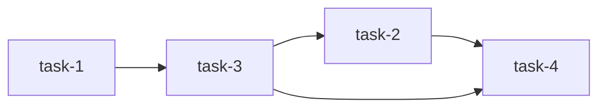

# Dependency Sorting

The core of the assignment is ordering tasks. Each task can say, through `requires`, which other tasks must come first. That makes the problem a [topological sort](https://en.wikipedia.org/wiki/Topological_sorting): tasks are nodes, requirements are edges, and a cycle means the job cannot be ordered.

## Example Graph

Using the sample request from [challenge-statement.pdf](challenge-statement.pdf), the dependencies look like this:



Arrows point from prerequisite to dependent: `A --> B` means "`B` requires `A`." So `task-3` waits for `task-1`, `task-2` waits for `task-3`, and `task-4` waits for both `task-2` and `task-3`.

One valid order is:

```text
task-1 -> task-3 -> task-2 -> task-4
```

## Kahn's Algorithm With Stable Tie-Breaking

Kahn's algorithm lines up nicely with the language of the assignment:

- A task is ready when everything it requires has already been emitted.
- Emitting a task may unlock other tasks.
- If there are tasks left but nothing is ready, the job has a cycle.

The sorter tracks each task's unmet dependency count. Tasks with zero unmet dependencies go into a ready set; when a task is emitted, the sorter lowers the count for tasks that depend on it.

When several tasks are ready, we choose the one that appeared earliest in the original request. That stable tie-breaker is handled by an ordered ready set, not by replacing Kahn's algorithm.

In Elixir, Erlang/OTP's `:gb_sets` can store `{input_index, task_name}` pairs for this without adding an external dependency. This is the Erlang standard-library module, called directly from Elixir as `:gb_sets`; it is not the external [`sets`](https://hexdocs.pm/sets/api-reference.html) Hex package. For this challenge, I would rather use the standard library and avoid unnecessary dependencies.

References:

- [`:gb_sets`](https://www.erlang.org/doc/apps/stdlib/gb_sets.html)
- [`sets`](https://hexdocs.pm/sets/api-reference.html)
- [`:graph`](https://www.erlang.org/doc/apps/stdlib/graph.html)

## Options Considered

| Option | Pros | Cons | Decision |
| --- | --- | --- | --- |
| Erlang [`:gb_sets`](https://www.erlang.org/doc/apps/stdlib/gb_sets.html) | Fits the ready-set part of Kahn's algorithm; keeps request-order tie-breaking explicit; uses a standard-library ordered set with logarithmic insert, lookup, and delete. | Still requires custom graph bookkeeping: in-degree counts, dependents, and task lookup. For very small inputs, an ordered list would also work. | Chosen. It keeps the sorting rule visible and deterministic without pulling in a heavier graph abstraction. |
| Erlang [`:graph`](https://www.erlang.org/doc/apps/stdlib/graph.html) | Functional graph structure; garbage collected; includes `topsort/1`; avoids the mutable ETS behavior of `:digraph`. | `topsort/1` gives a valid topological order, but not the request-order tie-breaker this API promises. Stable ordering would need extra handling around the graph result. | Not chosen. Good fit when any valid topological order is enough; less direct for this service's deterministic output contract. |
| Erlang [`:digraph`](https://www.erlang.org/doc/apps/stdlib/digraph.html) | Mature OTP graph module; useful for general directed graph operations; has companion utilities for graph algorithms. | Mutable ETS-backed structure; must be deleted or left to process cleanup; allows more graph features than this problem needs. | Not chosen. Powerful, but too much machinery for a short-lived request-level sort. |
| DFS topological sort | Standard topological sort; compact implementation; can detect cycles with visit states. | Stable output depends on traversal order; recursive traversal is less comfortable for large inputs; less natural for the "ready task" model. | Not chosen. Valid approach, but Kahn's algorithm maps more directly to unmet requirements becoming ready. |
| Repeated scanning | Minimal setup; easy to understand for tiny examples. | Rechecks dependencies again and again; can drift toward `O(tasks * dependencies)`; cycle detection is less clean. | Not chosen. Simple at first, but less tidy and less scalable than keeping explicit graph state. |

## Resulting Behavior

- Independent tasks keep their original request order.
- Cycles return the public error code `dependency_cycle`.
- The implementation stays small and dependency-light.
- The sorting code remains easy to unit test without HTTP involved.
